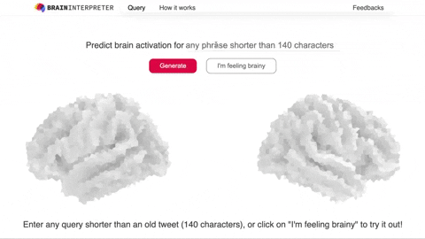

# Text2Brain Web Server

A webpage that deploys [Text2Brain](https://github.com/ngohgia/text2brain) model for predicting brain activation maps from free-form text query.
The webpage is built with Flask + SQLite + AngularJS + Redis + RQ.

----

## Broad picture
The setup is largely similar to this RealPython [tutorial](https://realpython.com/flask-by-example-part-2-postgres-sqlalchemy-and-alembic/) (we highly recommend going through this tutorial).
Essentially there are two main python files, `app.py` is the Flask web server and `worker.py` performs the inference.
`app.py` receives input query, which is then passed to a job that is queued by Redis and run in the background by `worker.py` without interfering with new web requests.

----

## How to run

Requirements:
- Install [virtualenv](https://virtualenv.pypa.io/en/latest) and install python 3.6.14
- Create a virtual environment with [venv](https://docs.python.org/3/tutorial/venv.htm) and install packages under `requirements.txt`
- Install [sqlite](https://www.sqlite.org/index.html)
- Install [redis](https://redis.io/)
- Download checkpoints from [Google Drive](https://drive.google.com/file/d/13Gc0M4i4zj16aVtZzGUQs4oPcoyRTGWw/view?usp=sharing) and do `tar -xzvf checkpoints.tar.gz`
- Download uncased SciBert pretrained model from [AllenAI S3](https://s3-us-west-2.amazonaws.com/ai2-s2-research/scibert/huggingface_pytorch/scibert_scivocab_uncased.tar) and unzip into `scibert_scivocab_uncased` directory

How to run locally in debug mode:
- Set the environment variables required by `config.py`
- Initialize the database `from app import db; db.create_all()`
- Run the worker `python worker.py`
- Run the web server on another terminal window/tab `python app.py`

----

## Bugs and Questions

Please contact Gia at ngohoanggia@gmail.com
